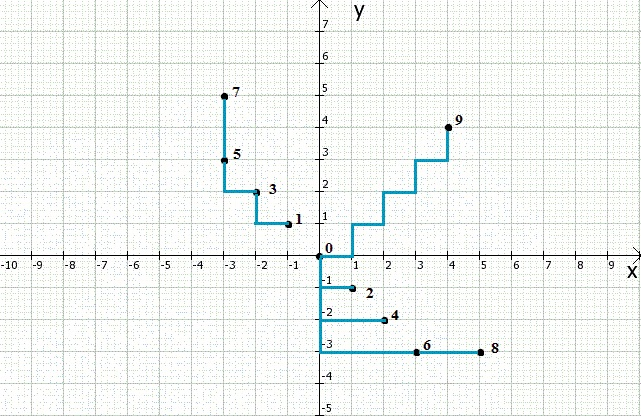

dotsPlacementIssue
============================
Algorithm solves the problem of the points placement according to the length which is specified in the matrix.

Implantation details
============================
The main idea of this algorithm is to try every possible combination of calculated coordinates until the correct answer(s) is found.
This is a recursive algorithm with backtracking approach.

Available solvers
============================
<ol type="1">
    <li>Python implementation - finds the first possible solution</li>
    <li>Java Cuncurrent Aproach
        <ul>
            <li>Based on ForkJoin task - use concurrent technique for solving the task</li>
            <li>Based on CountedCompleter task - similar to ForkJoin but with minimal interprocess communication</li>
        </ul>
    </li>
</ol>

Available visualization
============================
Java implementation has a JavaFX2 visualization:
  

Example
============================
The following matrix has been specified:
  
<table layout="fixed">
<tr align="center">
    <td width="20"> 0 </td><td width="20"> 2 </td><td width="20"> 2 </td><td width="20"> 4 </td><td width="20"> 4 </td><td width="20"> 6 </td><td width="20"> 6 </td><td width="20"> 8 </td><td width="20"> 8 </td><td width="20"> 8 </td>
</tr>
<tr align="center">
    <td> 2 </td><td> 0 </td><td> 4 </td><td> 2 </td><td> 6 </td><td> 4 </td><td> 8 </td><td> 6 </td><td> 10 </td><td> 8 </td>
</tr>
<tr align="center">
    <td> 2 </td><td> 4 </td><td> 0 </td><td> 6 </td><td> 2 </td><td> 8 </td><td> 4 </td><td> 10 </td><td> 6 </td><td> 8 </td>
</tr>
<tr align="center">
    <td> 4 </td><td> 2 </td><td> 6 </td><td> 0 </td><td> 8 </td><td> 2 </td><td> 10 </td><td> 4 </td><td> 12 </td><td> 8 </td>
</tr>
<tr align="center">
    <td> 4 </td><td> 6 </td><td> 2 </td><td> 8 </td><td> 0 </td><td> 10 </td><td> 2 </td><td> 12 </td><td> 4 </td><td> 8 </td>
</tr>
<tr align="center">
    <td> 6 </td><td> 4 </td><td> 8 </td><td> 2 </td><td> 10 </td><td> 0 </td><td> 12 </td><td> 2 </td><td> 14 </td><td> 8 </td>
</tr>
<tr align="center">
    <td> 6 </td><td> 8 </td><td> 4 </td><td> 10 </td><td> 2 </td><td> 12 </td><td> 0 </td><td> 14 </td><td> 2 </td><td> 8 </td>
</tr>
<tr align="center">
    <td> 8 </td><td> 6 </td><td> 10 </td><td> 4 </td><td> 12 </td><td> 2 </td><td> 14 </td><td> 0 </td><td> 16 </td><td> 8 </td>
</tr>
<tr align="center">
    <td> 8 </td><td> 10 </td><td> 6 </td><td> 12 </td><td> 4 </td><td> 14 </td><td> 2 </td><td> 16 </td><td> 0 </td><td> 8 </td>
</tr>
<tr align="center">
    <td> 8 </td><td> 8 </td><td> 8 </td><td> 8 </td><td> 8 </td><td> 8 </td><td> 8 </td><td> 8 </td><td> 8 </td><td> 0 </td>
</tr>
</table>

_Note_: Matrix must be <b>symmetric and square</b> one. 
        We skip the first row and col which are in range [0; <rows_length or cols_length>)  
According to the matrix we can say the distance between two dots.  Thus, the distances:  
<ul>
    <li> From point [0] to point [0] = 0 (distance to itself is zero -> obvious)</li>
    <li> From point [0] to point [1] = 2 </li>
    <li> Frm point [0] to point [2] = 2 
     ...
    <li> 0->9 = 8 </li>
    <li> 1->0 = 2 </li>
    <li> 1->1 = 0 (distance to itself is zero -> obvious)
     ...
</ul>

The initial dot 0 always has coordinates (0, 0). 
After running the program one of the results is:
 [(0, 0), (-1, 1), (1, -1), (-2, 2), (2, -2), (-3, 3), (3, -3), (-3, 5), (5, -3), (4, 4)] 
If we visualise the result using Cartesian coordinate system we will get the picture: 
    
  _Note_: Blue color was used to indicate rules of calculating the distance.
  __Pay attention__: The distance is not weight of the line which _directly_ connects two dots (lines may be angular).
